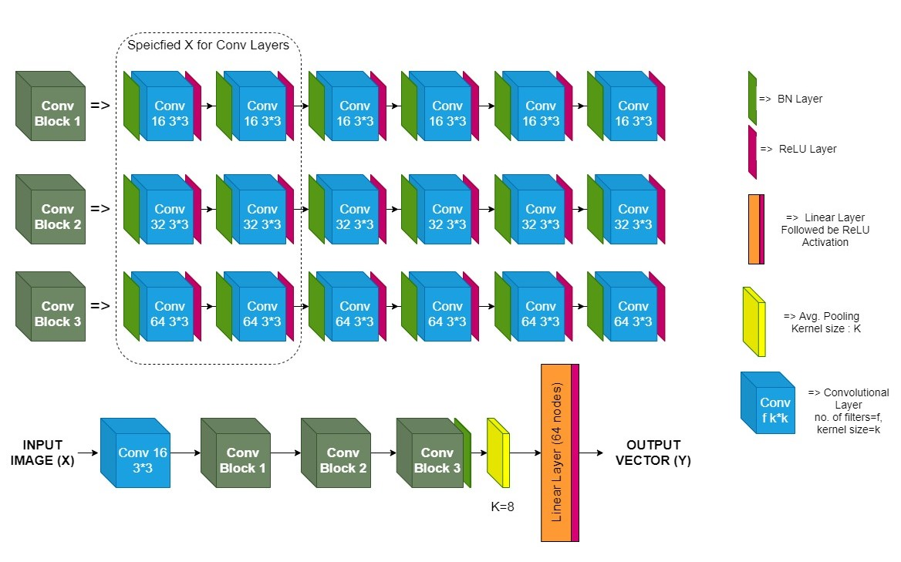
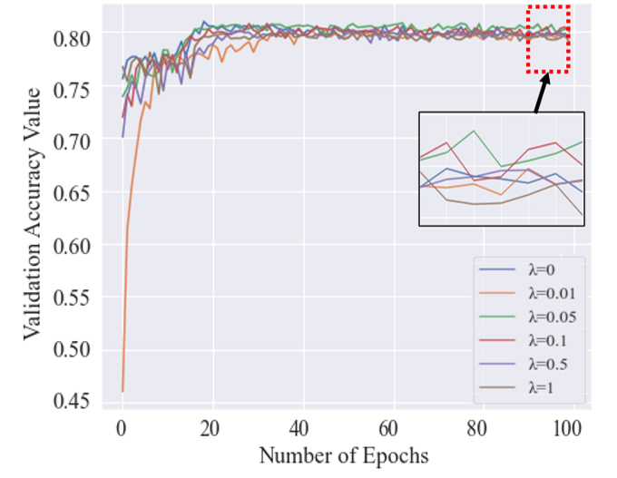

# orthogonal-dnn
Implementation of Orthogonal Deep Neural Network(ODNN) from this [reasearch paper](). Dataset taken here is [CIFAR-10](). It is used to classify the image by implementing ODNN using regularisation parameeter $\lambda$ and inferring its effects ranging from $0.01$ to $0.1$

## Theory

In this work, the main objective of the orthogonality is to reduce the correlation between the filters. This will help minimization the learned features redundancy, and hence the model capacity will be better utilized which improves the expressiveness of the features and accordingly the classification performance. The orthogonality is induced between the filters using the soft orthogonality constraints which has been achieved by adding the orthogonal loss with constant $\lambda$ to the network loss as described in the paper. The regularization parameter $\lambda$ constraints the orthogonality between the filters. In other words, when the filters are highly correlated, the value $\lambda$ needs to be high to enforce the filters to be orthogonal as possible. Likewise, $\lambda$ value is less when the filters are slightly correlated.

## Model

## Results

